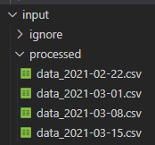
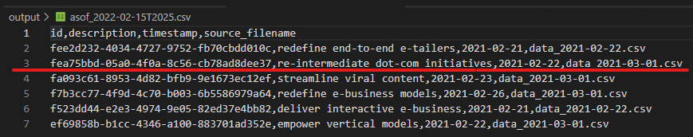
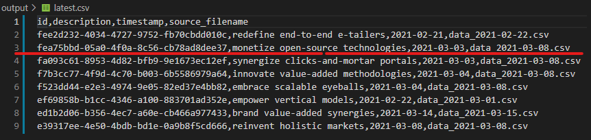

# Demo


## Synthetic dataset creation using Faker
1. Uses Faker library to generate synthetic data
   
```
CREATE_ROW_CODE = """
{
    "id": faker.words(1, uuids, False)[0],
    "description": faker.bs(),
    "timestamp": faker.date_between(datetime(2021, 2, 15), datetime(2022, 2, 15)),
}
"""


def create_rows(num_rows=1):
    faker = Faker()
    output = []
    for _ in range(num_rows):
        row = eval(CREATE_ROW_CODE)
        output.append(row)
    return output
```
2. 100,000 rows split into 50 files ordered by date 
   
```
def main():
    raw_df = pd.DataFrame(create_rows(100000))
    # split synthetic data into chunks to create multiple files
    dfs = np.array_split(raw_df.sort_values('timestamp'), 50)
    for df in dfs:
        max_date = df['timestamp'].max().strftime('%Y-%m-%d')
        df.to_csv(f"./input/unprocessed/data_{max_date}.csv", index=False)
```

3. Imitates a data workflow where csv files are received on a 1-2 week cadence and files are timestamped accordingly

    


## Batch processing of input csv files
1. code in `csv_utils.py`, function `batch_process()`
2. file management to track processed and unprocessed
3. snapshot creation of `./output/latest.csv`
   


4. updating `./output/latest.csv`



5. You can tell the `latest.csv` was updated for the id in row 3.  There is a new `description` string, `timestamp`, and `source_filename`

# How to use this repo
1. Create a python virtual environment and use the requirements.txt file to install dependencies
2. Generate a synthetic dataset using `generate_test_data.py`
3. Running `driver.py` will process all input csvs in `./input/processing` directory
4. `./output/latest.csv` will be created if it doesn't exist.  Otherwise it will be updated to reflect the latest timestamp for a particular id.

# Key Takeaways
1. Synthetic dataset creation using Faker
2. Structured dataset and pipeline to reflect a possible real use case
3. Snapshot management of the output data
4. Python `requirements.txt` and virtual environment setup


# Features to implement in the future
1. Logging
2. Error handling for bad data (e.g. fuzzy matching for slight differences in column headings, additional or missing columns, incompatible data type values, etc.)
   1. Automation in validating and correcting data.
3. More decision and logistics around what data to keep.  Maybe we don't decide to keep the input data and it's fine to just have output snapshots.
4. Convenience functions in csv_utils.py 
   1. Cleaning existing data and starting from scratch. 
   2. Resetting latest.csv to a previous snapshot
5. Integration with other data sources.  In this case it's just a file dump into a particular directory on a filesystem.
6. Jinja templating to handle different client implementations of the code
7. Exposing `./output/latest.csv` in a database or api as a source of truth
8. Potentially implement OOP instead of Functional programming as features expand and I gain more clarity into the various use cases and integrations with existing tools.